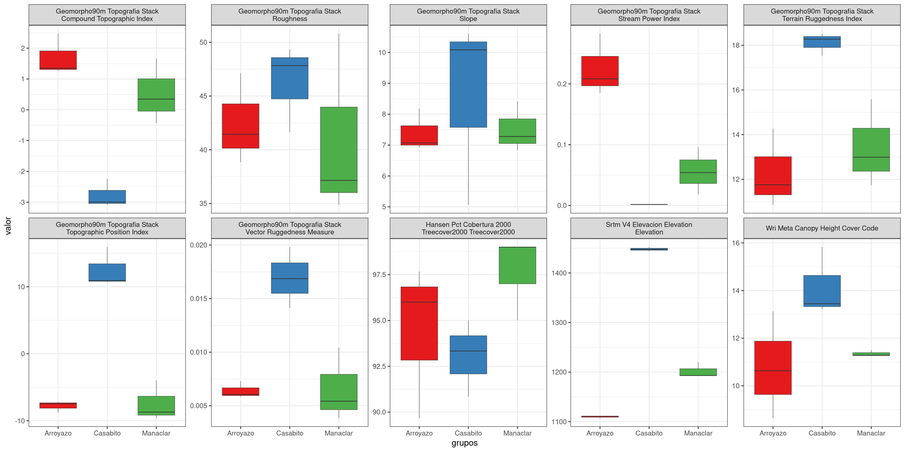
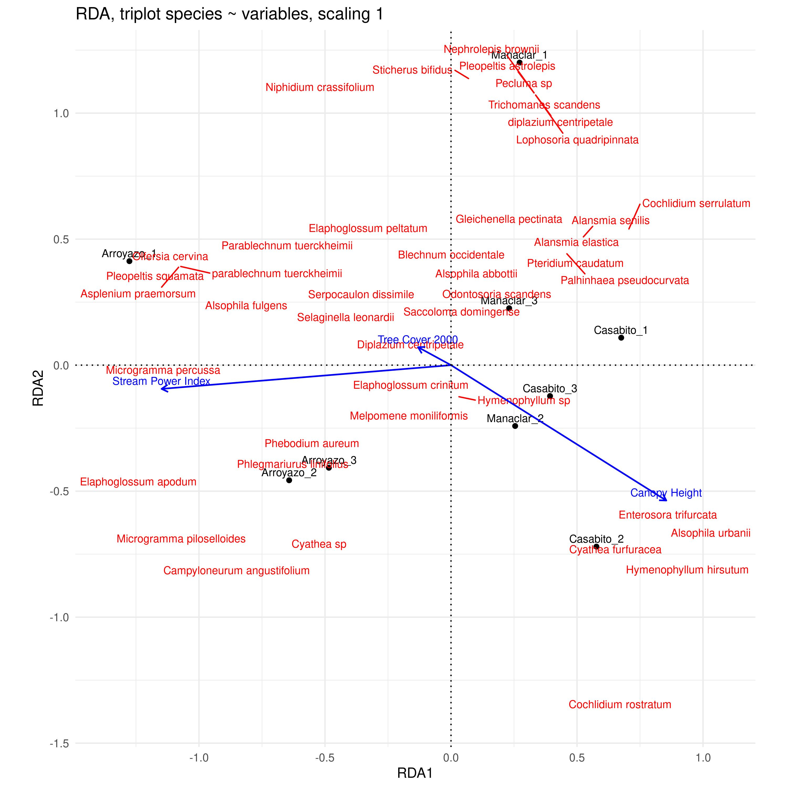

```{r setup, include=FALSE}
knitr::opts_chunk$set(
  echo = TRUE, 
  warning = FALSE,
  message = FALSE,
  # tidy = 'styler',
  # tidy.opts = list(blank = FALSE, width.cutoff = 60, force = T),
  fig.width = 8,
  dev = 'jpeg',
  dpi = 400)
```

## Preliminares

- Cargar paquetes.

```{r}
library(terra)
library(DT)
library(vegan)
library(sf)
library(tidyverse)
library(tmap)
library(kableExtra)
library(broom)
library(cluster)
library(gclus)
library(pvclust)
library(foreach)
library(leaps)
library(caret)
library(RColorBrewer)
library(indicspecies)
library(dendextend)
library(adespatial)
library(SpadeR)
library(iNEXT)
library(GGally)
library(vegetarian)
library(ggrepel)
gh_content <- 'https://raw.githubusercontent.com/'
gh_zonal_stats <- paste0(gh_content,
                         'geofis/zonal-statistics/0b2e95aaee87bf326cf132d28f4bd15220bb4ec7/out/')
repo_analisis <- 'biogeografia-master/scripts-de-analisis-BCI/master'
repo_sem202202 <- 'biogeografia-202202/material-de-apoyo/master/practicas/'
devtools::source_url(paste0(gh_content, repo_analisis, '/biodata/funciones.R'))
devtools::source_url(paste0(gh_content, repo_sem202202, 'train.R'))
devtools::source_url(paste0(gh_content, repo_sem202202, 'funciones.R'))
source('R/funciones.R')
umbral_alfa <- 0.05
```

## Análisis exploratorio de datos (AED)

- Cargar datos.

```{r}
datos_orig <- read_csv('RCEV.csv')
grupos_seleccionados <- rep(sort(unique(datos_orig$Localidad)), each = 3)
datos <- datos_orig %>% 
  # mutate(id = paste0(Localidad, '-', Transecto)) %>%
  mutate(id = paste0(Localidad, '_', Transecto)) %>% 
  select(-Localidad, -Transecto) %>% 
  group_by(Especies, Abundancia, id) %>% 
  distinct() # Para eliminar registros redundantes
transect_coords <- read_csv('transect_coordinates.csv') %>% 
  group_by(Location) %>% 
  mutate(`Transect number` = row_number()) %>% 
  ungroup() %>% 
  mutate(id = paste0(Location, '_', `Transect number`)) %>% 
  select(-Location, -`Transect number`, -Elevation) %>% 
  pivot_longer(-id, names_to = 'Coordinate type') %>% 
  separate(col = value, into = c('Latitude', 'Longitude'), convert = T, sep = ',')
transect_coords_sf <- transect_coords %>% 
  st_as_sf(coords = c('Longitude', 'Latitude'), crs = 4326, remove = F)
# transect_coords_sf %>% st_write('transect_coordinates.kml', delete_dsn = T)
```

- Generar matriz de comunidad.

```{r}
mc <- datos %>%
  pivot_wider(names_from = Especies, values_from = Abundancia, values_fill = 0) %>% 
  column_to_rownames('id')

mc_pooled <- mc %>%
    rownames_to_column('sitio') %>%
    mutate(sitio = gsub('_.*', '', sitio)) %>% 
    group_by(sitio) %>% 
    summarise(across(is.numeric, ~ sum(.x))) %>% 
    column_to_rownames('sitio')
```

### Gráfico de mosaico

```{r}
crear_grafico_mosaico_de_mc(mc)
```

### Preferencia

```{r}
set.seed(9999)
indval <- multipatt(
  mc,
  grupos_seleccionados,
  func = "IndVal.g",
  max.order = 1,
  control = how(nperm = 999))
summary(indval)
phi <- multipatt(
  mc,
  grupos_seleccionados,
  func = "r.g",
  max.order = 1,
  control = how(nperm = 999))
summary(phi)
```


## Índices

```{r}
indices <- alpha_div(mc) %>% 
  mutate(sitio = rownames(.)) %>% 
  relocate(sitio, .before = everything())
indices %>% estilo_kable()
```


```{r}
indices_pooled <- alpha_div(mc_pooled) %>% 
  mutate(sitio = rownames(.)) %>% 
  relocate(sitio, .before = everything())
indices_pooled %>% estilo_kable()
```

## "Completitud de muestra" y curva de acumulación

- "Completitud de muestra", estimadores tradicionales

```{r}
riqueza_estimaciones <- data.frame(estimateR(mc)) %>%
  rownames_to_column('Estimador') %>% 
  pivot_longer(-Estimador, names_to = 'Sitio', values_to = 'Estimado') %>% 
  pivot_wider(names_from = Estimador, values_from = Estimado) %>% 
  select(
    Sitio,
    `Riqueza observada` = S.obs,
    `Estimación por Chao1` = S.chao1,
    `Estimación por ACE` = S.ACE)
riqueza_estimaciones %>% estilo_kable(alinear = 'lrr')
```

```{r}
riqueza_estimaciones_pooled <- data.frame(estimateR(mc_pooled)) %>%
  rownames_to_column('Estimador') %>% 
  pivot_longer(-Estimador, names_to = 'Sitio', values_to = 'Estimado') %>% 
  pivot_wider(names_from = Estimador, values_from = Estimado) %>% 
  select(
    Sitio,
    `Riqueza observada` = S.obs,
    `Estimación por Chao1` = S.chao1,
    `Estimación por ACE` = S.ACE)
riqueza_estimaciones_pooled %>% estilo_kable(alinear = 'lrr')
```

- Estimador Chao mejorado

```{r}
df_spader <- data.frame(V1 = as.integer(sort(colSums(mc), decreasing = T)))
ChaoSpecies(df_spader, datatype = 'abundance',
            k = min(df_spader$V1), conf=0.95)
```

- Curva de acumulación

```{r}
mc_general <- mc %>%
  summarise_all(sum) %>%
  # mutate(N = nrow(mc)) %>%
  # relocate(N, .before = 1) %>%
  data.frame
nasin_raref <- iNEXT::iNEXT(
  x = t(mc_general),
  q=0,
  knots = 2000,
  datatype = 'abundance')
acumulacion_especies <- iNEXT::ggiNEXT(nasin_raref, type=1) +
  theme_bw() +
  theme(
    text = element_text(size = 20),
    panel.background = element_rect(fill = 'white', colour = 'black'),
    panel.grid.major = element_line(colour = "grey", linetype = "dashed", size = 0.25)
  ) +
  ylab('Species richness') +
  xlab('Abundance') +
  scale_y_continuous(breaks = seq(0, 80, length.out = 9)) +
  scale_color_manual(values = brewer.pal(8, 'Set2')) +
  scale_fill_manual(values = brewer.pal(8, 'Set2'))
acumulacion_especies
```

- Curva de acumulación por tipo de bosque

```{r}
mc_grupos <- mc %>%
  mutate(g = grupos_seleccionados) %>%
  group_by(g) %>%
  summarise_all(sum) %>%
  column_to_rownames('g') %>% 
  data.frame
nasin_raref_general <- iNEXT::iNEXT(
  x = t(mc_grupos),
  q=0,
  knots = 400,
  datatype = 'abundance')
acumulacion_especies_grupos <- iNEXT::ggiNEXT(nasin_raref_general, type=1) +
  theme_bw() +
  theme(
    text = element_text(size = 20),
    panel.background = element_rect(fill = 'white', colour = 'black'),
    panel.grid.major = element_line(colour = "grey", linetype = "dashed", size = 0.25)
  ) +
  ylab('Species richness') +
  xlab('Abundance') +
  scale_y_continuous(breaks = seq(0, 80, length.out = 9)) +
  scale_color_manual(values = brewer.pal(8, 'Set2'), labels = unique(grupos_seleccionados)) +
  scale_fill_manual(values = brewer.pal(8, 'Set2'), labels = unique(grupos_seleccionados)) +
  scale_shape_manual(values = c(16, 17, 15), labels = unique(grupos_seleccionados))
acumulacion_especies_grupos
```


## Asociación con variables ambientales

Explorar, aun siendo pocos transectos (en terreno tres transectos por formación es mucho, pero estadísticamente es poco), asociación con variables topográficas/geomorfológicas, cubierta y altura de dosel y elevación.

- Crear polígonos a partir de transectos

```{r}
# Creación de segmentos de líneas
transect_lines_sf <- transect_coords_sf %>%
    group_by(id) %>%
    summarise(geometry = st_cast(st_combine(geometry), "LINESTRING"), .groups = "drop")

# Crear polígonos con buffer
transect_pol_sf_20m <- transect_lines_sf %>%
  st_transform(32619) %>% 
  st_buffer(20) %>% 
  st_transform(4326)
```

- Leer rásters

```{r}
# Ruta a la carpeta que contiene los .tif
ruta_tifs <- "entradas"

# Leer todos los archivos tif (soporta multibanda automáticamente)
archivos_tif <- list.files(ruta_tifs, pattern = "\\.tif$", full.names = TRUE) %>% 
  grep(pattern = paste('cobertura_esa|cobertura_copernicus_2019|geomorfonos',
                       'formas_del_terreno|worldclim|heterogeneidad', 'MG_6073',
                       sep = '|'),
       invert = T, value = T)

# EPSG deseado
crs_deseado <- "EPSG:4326"

# Leer y reproyectar si es necesario
raster_list <- lapply(archivos_tif, function(f) {
  r <- rast(f)
  if (crs(r) != crs_deseado) {
    r <- project(r, crs_deseado, method = 'near')
  }
  r
})

# Leer los polígonos (asegúrate de que estén en EPSG:4326 también)
poligonos <- transect_pol_sf_20m |> 
  vect()  # convertir a objeto SpatVector de terra

# Categórico?
es_categorico <- c(FALSE, FALSE, FALSE, FALSE)

resultados <- Map(function(r, cat) {
  stat <- if (cat) "modal" else "mean"
  terra::extract(r, poligonos, fun = stat, na.rm = TRUE, bind = T)
}, raster_list, es_categorico)

# Añadir nombres basados en los archivos
names(resultados) <- basename(archivos_tif)

# Atributos
atributos_extraidos <- lapply(resultados, function(v) {
  # Obtener solo los atributos adicionales (excluyendo el ID si es redundante)
  as.data.frame(v)[, , drop = FALSE]  # asume que la primera columna es ID o igual para todos
})

# Combinar
foo <- do.call(cbind, atributos_extraidos)
# Obtener el nombre de la primera columna que termina en 'id'
columna_id <- grep("id$", names(foo), value = TRUE)[1]
# Combinar final
atributos_combinados <-  foo %>% 
  rename(id = all_of(columna_id)) %>% 
  rename_with(~ gsub('\\.tif\\.', '__', .x)) %>%
  rename_with(~ gsub('__discrete_classification', '', .x)) %>% 
  rename_with(~ gsub('\\.', '_', .x)) %>% 
  select(-ends_with('__id')) %>% 
  rename_with(~ gsub('_b1.*', '', .x))

# Uniendo
env_sf <- poligonos %>%
  st_as_sf() %>% 
  inner_join(atributos_combinados)

# Grupos
env <- env_sf %>% 
  st_drop_geometry() %>% 
  column_to_rownames('id')
env_grupos <- env %>%  
  mutate(grupos = factor(gsub('_.*$', '', rownames(.)))) %>% 
  pivot_longer(-c(grupos), names_to = "variable", values_to = "valor")

# Evaluando diferencias
env_grupos_ak <- env_grupos %>%
  group_by(variable) %>%
  summarise(
    p_valor_a = tryCatch(oneway.test(valor ~ grupos)$p.value, error = function(e) NA),
    p_valor_k = tryCatch(kruskal.test(valor ~ grupos)$p.value, error = function(e) NA)
    ) %>%
  arrange(p_valor_a)
# env_grupos_ak %>% estilo_kable(alinear = 'crr')
if(interactive()) {env_grupos_ak %>%
  datatable(options = list(pageLength = 140, autoWidth = FALSE),
            filter = 'top',) %>% 
  formatSignif(columns = "p_valor_a", digits = 1) %>%
  formatSignif(columns = "p_valor_k", digits = 1)
}
env_grupos_ak %>% kableExtra::kable()
```


```{r comment="", fig.width=8, fig.height=11, dpi=250}
# Graficando
env_grupos_p <- env_grupos %>% 
  ggplot() + aes(x = grupos, y = valor, group = grupos, fill = grupos) + 
  geom_boxplot(lwd = 0.2) + 
  scale_fill_brewer(palette = 'Set1') +
  theme_bw() +
  theme(legend.position="none") +
  facet_wrap(
    ~ variable, 
    scales = 'free_y',
    ncol = 5,
    labeller = labeller(
  variable = function(x) label_wrap_gen(width = 35)(stringr::str_to_title(gsub("_", " ", x))))
  )
# env_grupos_p
# Graficar
jpeg('salidas/env_grupos_p.jpg', width = 4000, height = 2000, res = 250)
env_grupos_p
dev.off()
```

\blandscape

```{r env_grupos_p, echo=FALSE, fig.cap="Variables ambientales por grupos"}

```

\elandscape

- Ordenación

```{r comment="", fig.width=9, fig.height=9, dpi=300}
mc_t <- decostand(mc, method = 'hellinger')
mc_t_ren <- mc_t %>%
  rename_all(~ paste('ESPECIE', .x))
env_spp <- env %>% bind_cols(mc_t_ren)
spp <- paste0('`', grep('^ESPECIE', colnames(env_spp), value = T), '`', collapse = ' + ')
my_formula <- as.formula(paste(spp, '~ .'))
set.seed(1); mod <- my_train(
  formula = my_formula, 
  # preproceso = 'scale',
  data = env_spp,
  num_variables = 3:4)
print_my_train(mod)
(covar <- grep(
  pattern = '\\(Intercept\\)',
  x = names(coef(mod$finalModel,unlist(mod$bestTune))),
  invert = T, value = T))
rda_mc_t <- rda(mc_t_ren %>% rename_all(~ gsub('^ESPECIE ', '', .)) ~ .,
                    env %>% select_at(all_of(gsub('\\`', '', covar))), scale = T)
```

A continuación, el resumen del análisis de redundancia.

```{r comment="", fig.width=9, fig.height=9, dpi=300}
summary(rda_mc_t)
```

El factor de inflación de la varianza.

```{r comment="", fig.width=9, fig.height=9, dpi=300}
vif.cca(rda_mc_t)
```

Represento el gráfico *triplot*.

```{r comment="", fig.width=13, fig.height=13, dpi=150}
# Triplot
escalado <- 1
plot(rda_mc_t,
     scaling = escalado,
     display = c("lc", "cn"),
     main = paste("Triplot de RDA especies ~ variables, escalamiento", escalado)
)
rda_mc_t_sc1 <- scores(rda_mc_t,
         choices = 1:2,
         scaling = escalado,
         display = "sp"
  )
text(rda_mc_t, "species", col="red", cex=0.8, scaling=escalado)
arrows(0, 0,
       rda_mc_t_sc1[, 1] * 0.9,
       rda_mc_t_sc1[, 2] * 0.9,
       length = 0,
       lty = 1,
       col = "red"
)
```

- Triplot con ggplot2

```{r}
# Extraer coordenadas
escalado <- 1
scores_rda <- scores(rda_mc_t, scaling = escalado)

# Sitios (lc: linear combinations)
sitios <- as_tibble(scores_rda$sites, rownames = "Sitio")

# Variables explicativas (cn: canonical axes)
variables <- as_tibble(scores_rda$biplot, rownames = "Variable")

# Estimar máximo de los sitios
max_sitios <- max(abs(c(sitios$RDA1, sitios$RDA2)))

# Estimar máximo de vectores
max_vectores <- max(abs(c(variables$RDA1, variables$RDA2)))

# Escalar vectores para que quepan proporcionalmente
escala_vectores <- max_sitios / max_vectores * 0.9

# Renombrar
variables <- variables %>%
  mutate(across(c(RDA1, RDA2), ~ . * escala_vectores)) %>% 
  mutate(Variable = case_when(
    Variable == "geomorpho90m_topografia_stack__Stream_Power_Index" ~ "Stream Power Index",
    Variable == "hansen_pct_cobertura_2000_treecover2000__treecover2000" ~ "Tree Cover 2000",
    Variable == "wri_meta_canopy_height__cover_code" ~ "Canopy Height",
    TRUE ~ Variable
  ))

# Especies (sp: species scores)
especies <- as_tibble(scores(rda_mc_t, display = "species", scaling = escalado), rownames = "Especie")

# Gráfico base
triplot_ggplot <- ggplot() +
  # Sitios
  geom_point(data = sitios, aes(x = RDA1, y = RDA2), color = "black") +
  geom_text(data = sitios, aes(x = RDA1, y = RDA2, label = Sitio), hjust = 0.5, vjust = -0.5, size = 3) +

  # Especies
  # geom_text(data = especies,
  #           aes(x = RDA1, y = RDA2, label = Especie),
  #           color = "red", size = 3) +
  geom_text_repel(data = especies,
                  aes(x = RDA1, y = RDA2, label = Especie),
                  color = "red", size = 3, max.overlaps = 50) +

  # Variables ambientales
  geom_segment(data = variables,
               aes(x = 0, y = 0, xend = RDA1, yend = RDA2),
               arrow = arrow(length = unit(0.2, "cm")),
               color = "blue", linewidth = 0.6) +
  geom_text(data = variables,
            aes(x = RDA1, y = RDA2, label = Variable),
            color = "blue", hjust = 0.5, vjust = -0.5, size = 3) +

  # Ejes
  geom_hline(yintercept = 0, linetype = "dotted") +
  geom_vline(xintercept = 0, linetype = "dotted") +
  labs(title = paste("RDA, triplot species ~ variables, scaling", escalado),
       x = "RDA1", y = "RDA2") +
  coord_equal() +
  theme_minimal()

# Graficar
jpeg('salidas/triplot_ggplot.jpg', width = 3000, height = 3000, res = 350)
triplot_ggplot
dev.off()
```

\blandscape

```{r triplot_ggplot, echo=FALSE, fig.cap="Triplot en ggplot"}

```

\elandscape


## Scripts heredados

### Hill.R

```{r, eval=F}
# Cargar los datos desde el archivo RCEV.csv
ruta_archivo <- "C:/Users/jazmi/OneDrive/Documents/tesis-daniel/RCEV.csv"
datos <- read.csv(ruta_archivo)
library(dplyr)
library(vegan)
library(tidyr)
library(ggplot2)
# Suponiendo que tus datos están en un data frame llamado 'datos'
# Aquí hay un ejemplo de cómo pueden verse tus datos
# datos <- data.frame(
#   Localidad = c("Loc1", "Loc1", "Loc2", "Loc2"),
#   Transecto = c("Tran1", "Tran1", "Tran2", "Tran2"),
#   Especies = c("Especie1", "Especie2", "Especie1", "Especie2"),
#   Abundancia = c(10, 15, 5, 20)
# )

# Calcular los Números de Hill
calcular_hill <- function(data) {
  # Crear una matriz de abundancias por especies
  matriz_abundancias <- data %>%
    group_by(Localidad, Especies) %>%
    summarize(Abundancia = sum(Abundancia), .groups = 'drop') %>%
    spread(Especies, Abundancia, fill = 0)
  
  # Eliminar la columna de Localidad para la matriz de abundancia
  localidades <- matriz_abundancias$Localidad
  matriz_abundancias <- matriz_abundancias %>% select(-Localidad)
  
  # Calcular los índices de diversidad
  H0 <- rowSums(matriz_abundancias > 0) # Riqueza de especies
  H1 <- exp(diversity(matriz_abundancias, index = "shannon")) # Exponencial del índice de Shannon
  H2 <- 1 / diversity(matriz_abundancias, index = "simpson") # Inverso del índice de Simpson
  
  return(data.frame(Localidad = localidades, H0 = H0, H1 = H1, H2 = H2))
}

# Calcular los números de Hill para tus datos
hill_results <- calcular_hill(datos)

# Imprimir resultados
print(hill_results)

# Transformar los resultados para graficar
hill_df_long <- gather(hill_results, key = "Indice", value = "Valor", -Localidad)

# Graficar los resultados
ggplot(hill_df_long, aes(x = Localidad, y = Valor, fill = Indice)) +
  geom_bar(stat = "identity", position = "dodge") +
  theme_minimal() +
  labs(title = "Números de Hill", x = "Localidad", y = "Valor del Índice") +
  scale_fill_manual(values = c("H0" = "blue", "H1" = "red", "H2" = "green")) +
  theme(plot.title = element_text(hjust = 0.5))
```

### similitud.R

```{r, eval=F}
# Cargar los datos desde el archivo RCEV.csv
ruta_archivo <- "C:/Users/jazmi/OneDrive/Documents/tesis-daniel/RCEV.csv"
datos <- read.csv(ruta_archivo)
# Instalar y cargar las librerías necesarias

library(heatmaply)

# Definir una función para calcular la similitud de Jaccard entre tres localidades específicas
calcular_similitud_jaccard_tres_localidades <- function(datos, localidad1, localidad2, localidad3) {
  # Obtener los datos de las tres localidades
  datos_localidades <- datos[datos$Localidad %in% c(localidad1, localidad2, localidad3), ]
  
  # Obtener las especies únicas en las tres localidades
  especies <- unique(datos_localidades$Especies)
  
  # Crear una matriz binaria de presencia/ausencia para las especies en las tres localidades
  datos_binarios <- matrix(0, nrow = 3, ncol = length(especies))
  rownames(datos_binarios) <- c(localidad1, localidad2, localidad3)
  colnames(datos_binarios) <- especies
  
  for (i in 1:nrow(datos_localidades)) {
    localidad <- datos_localidades[i, "Localidad"]
    especie <- datos_localidades[i, "Especies"]
    abundancia <- datos_localidades[i, "Abundancia"]
    datos_binarios[localidad, especie] <- ifelse(abundancia > 0, 1, 0)
  }
  
  # Calcular la similitud de Jaccard entre las tres localidades
  similitud_jaccard <- matrix(NA, nrow = 3, ncol = 3)
  for (i in 1:2) {
    for (j in (i+1):3) {
      numerador <- sum(datos_binarios[i,] & datos_binarios[j,])
      denominador <- sum(datos_binarios[i,] | datos_binarios[j,])
      similitud_jaccard[i,j] <- numerador / denominador
      similitud_jaccard[j,i] <- similitud_jaccard[i,j]
    }
  }
  
  return(similitud_jaccard)
}

# Calcular la similitud de Jaccard entre las tres localidades específicas
similitud_jaccard_tres_localidades <- calcular_similitud_jaccard_tres_localidades(datos, "Casabito", "Manaclar", "Arroyazo")

# Crear el mapa de calor utilizando heatmaply
heatmaply(similitud_jaccard_tres_localidades, 
          symmetric = TRUE, 
          labRow = c("Casabito", "Manaclar", "Arroyazo"),
          labCol = c("Casabito", "Manaclar", "Arroyazo"),
          main = "Mapa de Calor de Similitud de Jaccard entre Localidades",
          col = c("red", "orange", "green"))


######
# Cargar los datos desde el archivo RCEV.csv
ruta_archivo <- "C:/Users/jazmi/OneDrive/Documents/tesis-daniel/RCEV.csv"
datos <- read.csv(ruta_archivo)

# Instalar y cargar las librerías necesarias
if (!requireNamespace("heatmaply", quietly = TRUE)) {
  install.packages("heatmaply")
}
library(heatmaply)

# Definir una función para calcular la similitud de Jaccard entre tres localidades específicas
calcular_similitud_jaccard_tres_localidades <- function(datos, localidad1, localidad2, localidad3) {
  # Obtener los datos de las tres localidades
  datos_localidades <- datos[datos$Localidad %in% c(localidad1, localidad2, localidad3), ]
  
  # Obtener las especies únicas en las tres localidades
  especies <- unique(datos_localidades$Especies)
  
  # Crear una matriz binaria de presencia/ausencia para las especies en las tres localidades
  datos_binarios <- matrix(0, nrow = 3, ncol = length(especies))
  rownames(datos_binarios) <- c(localidad1, localidad2, localidad3)
  colnames(datos_binarios) <- especies
  
  for (i in 1:nrow(datos_localidades)) {
    localidad <- datos_localidades[i, "Localidad"]
    especie <- datos_localidades[i, "Especies"]
    abundancia <- datos_localidades[i, "Abundancia"]
    datos_binarios[localidad, especie] <- ifelse(abundancia > 0, 1, 0)
  }
  
  # Calcular la similitud de Jaccard entre las tres localidades
  similitud_jaccard <- matrix(NA, nrow = 3, ncol = 3)
  for (i in 1:2) {
    for (j in (i+1):3) {
      numerador <- sum(datos_binarios[i,] & datos_binarios[j,])
      denominador <- sum(datos_binarios[i,] | datos_binarios[j,])
      similitud_jaccard[i,j] <- numerador / denominador
      similitud_jaccard[j,i] <- similitud_jaccard[i,j]
    }
  }
  
  return(similitud_jaccard)
}

# Calcular la similitud de Jaccard entre las tres localidades específicas
similitud_jaccard_tres_localidades <- calcular_similitud_jaccard_tres_localidades(datos, "Casabito", "Manaclar", "Arroyazo")

# Crear el mapa de calor utilizando heatmaply con paleta de colores RColorBrewer
heatmaply(similitud_jaccard_tres_localidades, 
          symmetric = TRUE, 
          labRow = c("Casabito", "Manaclar", "Arroyazo"),
          labCol = c("Casabito", "Manaclar", "Arroyazo"),
          main = "Mapa de Calor de Similitud de Jaccard entre Localidades",
          col = colorRampPalette(brewer.pal(n = 7, name = "YlOrRd"))(100),  # Usar paleta YlOrRd de RColorBrewer
          fontsize_row = 12,   # Tamaño de fuente para las etiquetas de fila
          fontsize_col = 12,   # Tamaño de fuente para las etiquetas de columna
          showticklabels = TRUE,  # Mostrar etiquetas en los ejes
          limits = c(0, 1),    # Límites del colorbar
          na.rm = TRUE         # Eliminar valores NA si los hay
)
```

### Dominancia

```{r, eval=F}
# Cargar los datos desde el archivo RCEV.csv
ruta_archivo <- "C:/Users/jazmi/OneDrive/Documents/tesis-daniel/RCEV.csv"
datos <- read.csv(ruta_archivo)

# Definir función para calcular el Índice de Dominancia de Simpson
calcular_dominancia <- function(abundancia) {
  # Suma de cuadrados de los recuentos de especies
  suma_cuadrados <- sum(abundancia^2)
  
  # Total de individuos
  total_individuos <- sum(abundancia)
  
  # Índice de Dominancia de Simpson
  dominancia <- suma_cuadrados / (total_individuos^2)
  
  return(dominancia)
}

# Calcular la dominancia para cada localidad
dominancia_por_localidad <- aggregate(datos$Abundancia, by=list(Localidad=datos$Localidad), FUN=calcular_dominancia)

# Renombrar columnas
colnames(dominancia_por_localidad) <- c("Localidad", "Indice_Dominancia")

# Mostrar el resultado
print(dominancia_por_localidad)

library(ggplot2)

## Graficar la dominancia por localidad
ggplot(dominancia_por_localidad, aes(x=Localidad, y=Indice_Dominancia, fill=Indice_Dominancia)) +
  geom_bar(stat="identity") +
  scale_fill_gradient(low = "lightblue", high = "darkblue") +
  labs(title="Dominancia de especies por localidad",
       x="Localidad", y="Índice de Dominancia") +
  theme(axis.text.x = element_text(angle = 90, hjust = 1)) +
  guides(fill = guide_legend(title = "Índice de Dominancia"))

ruta_archivo <- "C:/Users/jazmi/OneDrive/Documents/tesis-daniel/RCEV.csv"
datos <- read.csv(ruta_archivo)

library(heatmaply)

# Definir una función para calcular la distancia de Jaccard
calcular_distancia_jaccard <- function(matriz_binaria) {
  n <- nrow(matriz_binaria)
  distancia_jaccard <- matrix(NA, n, n)
  
  for (i in 1:(n - 1)) {
    for (j in (i + 1):n) {
      # Calcular el numerador (número de especies compartidas)
      numerador <- sum(matriz_binaria[i, ] & matriz_binaria[j, ])
      
      # Calcular el denominador (número de especies presentes en al menos una de las localidades)
      denominador <- sum(matriz_binaria[i, ] | matriz_binaria[j, ])
      
      # Calcular la distancia de Jaccard
      distancia_jaccard[i, j] <- 1 - (numerador / denominador)
      distancia_jaccard[j, i] <- distancia_jaccard[i, j]
    }
  }
  
  # Llenar la diagonal con ceros
  diag(distancia_jaccard) <- 0
  
  return(distancia_jaccard)
}

# Agregar prefijo único a los nombres duplicados
rownames(datos_binarios) <- make.unique(as.character(datos$Localidad))
colnames(datos_binarios) <- make.unique(as.character(datos$Localidad))

# Calcular la matriz de distancia de Jaccard
matriz_similitud_jaccard <- calcular_distancia_jaccard(datos_binarios)

# Graficar el mapa de calor de la matriz de similitud de Jaccard
heatmaply(matriz_similitud_jaccard, 
          symmetric = TRUE, # Indica si la matriz es simétrica (en este caso, sí)
          labRow = rownames(datos_binarios), # Etiquetas de las filas
          labCol = colnames(datos_binarios), # Etiquetas de las columnas
          main = "Mapa de Calor de Similitud (Distancia de Jaccard)")
```

